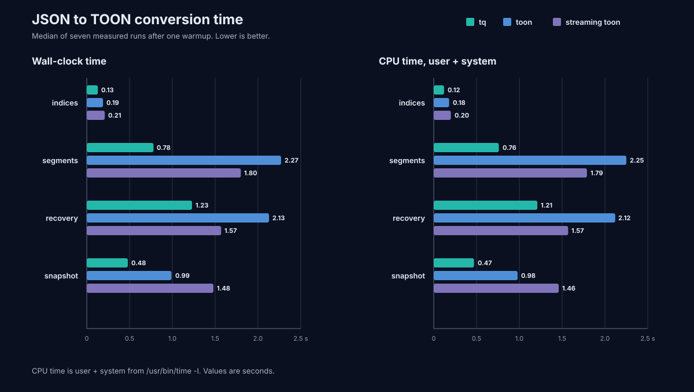
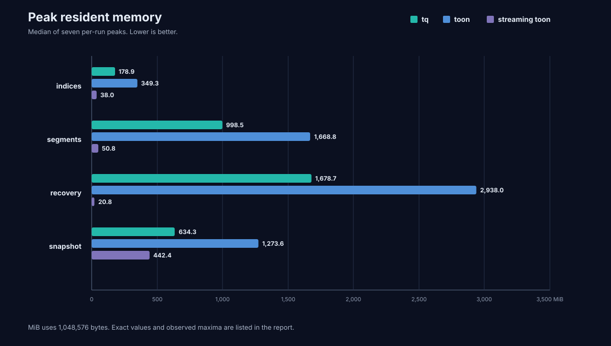

# `toon` vs. `tq` JSON-to-TOON faceoff

The follow-up campaign changes the conclusion. `tq` is still the fastest CLI,
but streaming `toon` is the clear memory winner. The original comparison built
the fork with default features, which did not enable its `json_stream` feature
despite the branch name.

The three-way campaign compares:

- `tq`, using its configured thin-LTO release profile
- `toon`, using the fork's default `cli` feature and default release profile
- `toon_stream`, built from the same fork commit with `json_stream` enabled

All three ran together with seven measured samples per case. Run order rotated
between samples.

## Results





Each value is the median of seven runs after one discarded warmup. CPU time is
user plus system time. RSS uses MiB, where one MiB is 1,048,576 bytes.

| Input | Wall, `tq` | Wall, `toon` | Wall, streaming `toon` | CPU, `tq` | CPU, `toon` | CPU, streaming `toon` |
| --- | ---: | ---: | ---: | ---: | ---: | ---: |
| `indices.json` | 0.13 s | 0.19 s | 0.21 s | 0.12 s | 0.18 s | 0.20 s |
| `segments.json` | 0.78 s | 2.27 s | 1.80 s | 0.76 s | 2.25 s | 1.79 s |
| `recovery.json` | 1.23 s | 2.13 s | 1.57 s | 1.21 s | 2.12 s | 1.57 s |
| `snapshot.json` | 0.48 s | 0.99 s | 1.48 s | 0.47 s | 0.98 s | 1.46 s |

`tq` was 1.46x to 2.91x faster than default `toon` and 1.28x to 3.08x
faster than streaming `toon`. The streaming path helped the object-heavy
`segments` and `recovery` cases, but it slowed both top-array-heavy cases.

| Input | RSS, `tq` | RSS, `toon` | RSS, streaming `toon` | Streaming reduction vs. `tq` |
| --- | ---: | ---: | ---: | ---: |
| `indices.json` | 178.9 MiB | 349.3 MiB | 38.0 MiB | 78.8% |
| `segments.json` | 998.5 MiB | 1,668.8 MiB | 50.8 MiB | 94.9% |
| `recovery.json` | 1,678.7 MiB | 2,938.0 MiB | 20.8 MiB | 98.8% |
| `snapshot.json` | 634.3 MiB | 1,273.6 MiB | 442.4 MiB | 30.3% |

Streaming `toon` cut its own default-path RSS by 65.3% to 99.3%. The 20.8 MiB
result on the 73.6 MiB recovery document is the important number here. It shows
that a wide object can be converted without retaining the input or output as a
complete document.

The largest observed RSS values were:

| Input | `tq` | `toon` | Streaming `toon` |
| --- | ---: | ---: | ---: |
| `indices.json` | 179.0 MiB | 404.6 MiB | 38.0 MiB |
| `segments.json` | 1,008.8 MiB | 1,919.7 MiB | 52.2 MiB |
| `recovery.json` | 1,713.8 MiB | 3,297.6 MiB | 21.0 MiB |
| `snapshot.json` | 772.5 MiB | 1,274.2 MiB | 443.3 MiB |

The machine-readable medians and ranges are in
[`2026-08-27-toon-vs-tq.csv`](2026-08-27-toon-vs-tq.csv).

## What the streaming result teaches `tq`

`tq` does not need to replace its document evaluator. It needs a second path
for conversions that do not need the full document in memory.

The benchmark used the identity filter `.`. Today that filter selects the
document plan, so `tq` reads the complete input, builds a `serde_json::Value`,
converts it into an `Arc`-backed `tq_core::Value`, runs the VM, builds TOON as a
`Vec<String>`, and joins those lines into one final `String`. That is fast, but
the recovery result shows the cost: 1,678.7 MiB median RSS for a 73.6 MiB input.

Streaming `toon` takes a different route. Its Serde visitor writes object
members as they arrive. It retains array state because TOON array headers need
the length and because tabular layout cannot be selected from the first item
alone. This explains the shape-sensitive results:

- A wide root object such as `recovery` can flow almost directly from reader to
  writer, producing 20.8 MiB RSS.
- `segments` can release large object members as it advances, producing 50.8
  MiB RSS.
- The nested snapshot array still needs substantial preparation, producing
  442.4 MiB RSS.

The best design for `tq` is a hybrid:

| Query and output | Execution path |
| --- | --- |
| Identity query with TOON output | Direct decoder-to-TOON transcode |
| Statically bounded projection | Existing event or subtree plan |
| General jq program | Existing document VM |
| Unknown-length array during transcode | Bounded memory preparation, then disk spool |

### 1. Add a direct identity-transcode plan

The planner can recognize `.` with JSON input and TOON output before it builds
a document VM. A Serde `DeserializeSeed` can write object members directly to
the TOON sink. Nested objects need no whole-sibling retention when key folding
is off.

Arrays are the exception. Their header needs a count, and tabular encoding
needs a stable schema. `tq` already has most of the missing mechanism in
[`PreparedArray`](../crates/tq-toon/src/spool.rs): it tracks array length and
layout, retains a bounded number of bytes, transitions to a private temporary
file, and replays after the layout is known. It is currently unused by the CLI
path.

This should be a distinct plan, not a hidden shortcut inside the VM. Explain
output and benchmark reports should identify it as `transcode` and report
whether an array used memory or disk preparation.

### 2. Make the TOON writer write to `Write`

The current encoder accumulates lines and calls `join("\n")`. Unframed output
then writes that complete string. A sink-backed encoder would remove the final
output copy for all execution plans, including queries that still need a full
document.

This is the smallest useful change. It will not remove DOM memory, but it
should reduce snapshot-like peaks where TOON output is close to input size.

### 3. Deserialize directly into `tq_core::Value`

The current `Deserialize` implementation first creates a
`serde_json::Value`, then consumes it into `tq_core::Value`. A custom visitor
can build `Arc<str>`, `Arc<[Value]>`, and ordered objects directly. That removes
one transient tree from every document-mode query without changing the VM.

The same principle applies in the other direction. `Value::serialize` now
calls `to_json()` before Serde writes it. Direct serialization would avoid a
second tree and make array spooling cheaper.

### 4. Rework `PreparedArray` before putting it on the hot path

`PreparedArray` currently serializes every value to JSON bytes, and replay
deserializes those bytes again. Because `Value::serialize` first constructs a
`serde_json::Value`, using the spool as-is would save memory but burn more CPU
than necessary.

The preparation format should write values directly or store a compact framed
representation. Its metadata only needs count, scalar eligibility, tabular
schema, and the values required for replay. The existing memory threshold and
secure disk transition are worth keeping.

### 5. Do not copy streaming `toon`'s speculative array renderer

Streaming `toon` retains `primitive_chunks`, `nested_chunks`, and
`tabular_rows`. For a possible tabular array it can render both expanded and
tabular forms before choosing one. That likely explains why streaming saves
memory but remains slower, especially on `snapshot`.

`tq` should use one bounded replay source and render only the selected layout.
The spool costs an extra pass and possible disk I/O, but it avoids duplicate
formatting work and gives the memory ceiling a clear meaning.

### Recommended implementation order

| Order | Change | Scope | Expected effect |
| ---: | --- | --- | --- |
| 1 | Sink-backed TOON writer | All TOON output | Removes complete output assembly and final join |
| 2 | Direct `tq_core::Value` deserializer and serializer | Document plans and spool | Removes transient `serde_json::Value` trees |
| 3 | Identity-transcode plan for root objects | JSON `.` to TOON | Brings wide-object RSS toward the streaming `toon` range |
| 4 | Connect and optimize `PreparedArray` | Nested and root arrays | Bounds array memory with explicit disk tradeoff |
| 5 | Extend output-aware planning beyond `.` | Proven projections | Applies bounded conversion to more jq-compatible filters |

A useful first gate would be completion below 64 MiB RSS for `recovery` and
`segments` in identity-transcode mode. Array-heavy cases need a separate gate
that records spool bytes and disk time, because a low RSS number alone can hide
large I/O cost.

## Why default `toon` used so much memory

The default fork build does not include `json_stream`; its feature list is
`default = ["cli"]`. That path reads the complete input into a `String`, parses
a `serde_json::Value`, calls `serde_json::to_value` on that value, converts the
second tree into the fork's owned `JsonValue`, and deep-clones it for
normalization. Shared dependencies do not make those allocation paths equal.

The streaming build bypasses those full-document copies with
`serde_json::Deserializer::from_reader` and a writer seed. Its output bytes are
identical to default `toon` on every timed case.

Compiler settings are secondary. A separate three-run probe rebuilt default
`toon` with `codegen-units=1` and thin LTO to match `tq`. It improved the two
map-heavy cases by roughly 5% to 11%, did not change `indices`, and slightly
slowed `snapshot`. That is useful but too small to explain the main gap.

## Inputs and output sizes

The natural files were not resized or rewritten.

| Input | Shape | Bytes | SHA-256 |
| --- | --- | ---: | --- |
| `indices.json` | Top-level array of 21,117 objects | 6,992,246 | `0a3cc4a84cc826ce5631b73e4c51bdd58e6c26864618565c2108558337b8f6d9` |
| `segments.json` | Object containing 2,780 index members under `indices` | 39,285,800 | `7d5edfbb666ee53ed58593462dbbd6b4d6efc94c3458f9d2db1605a622fb7708` |
| `recovery.json` | Wide object with 2,780 top-level members | 77,191,748 | `c0fbd62a341257d8d2d8dd39998352200fd5ae3b8a87c71349af40e9a45e82cd` |
| `snapshot.json` | Object dominated by a 2,921-item `snapshots` array | 147,500,561 | `7ff6a585e1e0704283f511ba7ae9daf5f84d572f70d88e66e229c864e6dd6db6` |

| Input | `tq` output | Both `toon` outputs | `tq` reduction |
| --- | ---: | ---: | ---: |
| `indices.json` | 3,930,378 | 4,023,402 | 2.31% |
| `segments.json` | 63,162,527 | 63,479,293 | 0.50% |
| `recovery.json` | 51,048,763 | 51,325,451 | 0.54% |
| `snapshot.json` | 142,736,118 | 147,483,594 | 3.22% |

## Correctness gate

The runner encoded each original document with all three binaries before
timing. It decoded every output with the same `tq` decoder, canonicalized JSON
with `jq -S -c`, and required the result to match the source semantic SHA-256.

`indices`, `segments`, `recovery`, and `snapshot` passed. The `toon` decoder
changed the semantic hash for both encoders' output on `segments` and
`recovery`; both decoders agreed on `indices` and `snapshot`.

Two candidates were excluded:

| Input | Bytes | Result |
| --- | ---: | --- |
| `mapping.json` | 47,509,750 | All encoded outputs failed the common semantic hash. The document contains a literal field named `null`; the `toon` decoder rejected the emitted `null:` line in strict mode, while `tq` decoded it with changed semantics. |
| `nodes_stats.json` | 49,347,881 | All encoded outputs decoded successfully but differed from the source semantic hash. |

## Method

The source directory is supplied as `INPUT_DIR`; its local path is not stored
in the report, CSV, charts, or runner. The conversion commands were:

```sh
tq -i json -o toon --unframed '.' INPUT > /dev/null
$TOON_DEFAULT_BIN INPUT -o /dev/null
$TOON_STREAM_BIN INPUT -o /dev/null
```

Each case had one warmup per binary and seven measured runs. Binary order used
a repeating three-way rotation. `/usr/bin/time -l` provided wall time, user
time, system time, and maximum resident set size. Output went to `/dev/null`,
so the measurements exclude filesystem storage cost.

The checked-in runner is
[`cases/toon-vs-tq.sh`](cases/toon-vs-tq.sh). A replay looks like this:

```sh
cargo build --release

CARGO_TARGET_DIR="$PWD/benchmarks/.work/toon-default" \
  cargo build --release --manifest-path "$TOON_CHECKOUT/Cargo.toml"

CARGO_TARGET_DIR="$PWD/benchmarks/.work/toon-stream" \
  cargo build --release --features json_stream \
  --manifest-path "$TOON_CHECKOUT/Cargo.toml"

RUNS=7 bash benchmarks/cases/toon-vs-tq.sh \
  "$INPUT_DIR" \
  target/release/tq \
  benchmarks/.work/toon-default/release/toon \
  benchmarks/.work/toon-stream/release/toon \
  benchmarks/.work/toon-vs-tq/replay
```

Raw logs, generated TOON, hashes, and measurements remain in the ignored
`.work` directory.

## Environment and binaries

- Apple M4 Pro, 14 cores, 48 GB memory
- macOS 26.6, Darwin 25.6.0, arm64
- Rust 1.98.0, LLVM 22.1.8
- `tq` 0.1.0 at commit `d39d9a17c3aab93c0510935ca83f2707f1611394`, binary SHA-256 `5376e5e50bacab5a1651f453a20e21d61e73c9d8c15921a6a1e466276bb649ea`
- Default `toon` 0.4.5 at fork commit `9c7007a358e25a0c453fd54e02e287ac465ea824`, binary SHA-256 `657f156198e3604076004708bda779dc87d685ac06ac881e3d64be66cfc2e177`
- Streaming `toon` from the same commit, binary SHA-256 `d21d87cc4577162283797b431575708a19afd6ab07515f173d14778e42296f00`

## Limits

This is one Apple Silicon machine with warm filesystem caches. The smallest
case is near the 0.01-second reporting resolution of `/usr/bin/time`. The run
does not measure cold-cache behavior, energy, library-only encode cost, or the
disk cost of a bounded array spool. RSS includes allocator behavior as well as
live data.
